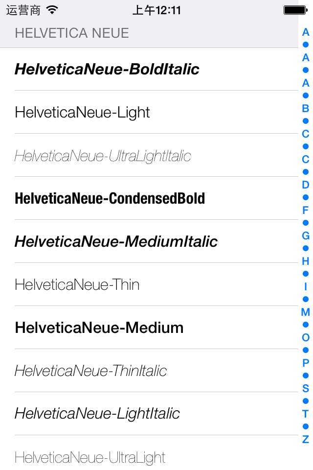

Fonts
=====

A simple project to display all the fonts and its FULL NAME, so that 
you can use it in your project with a customed font this way:

    UILabel *label = ...;
    label.font = [UIFont fontWithName:<#FULL NAME#> size:...];
    ...
    

